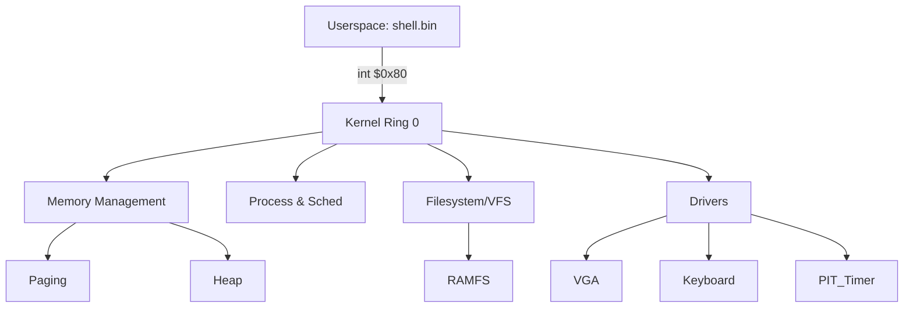

**GitHub Repository:** [View Source Code](https://github.com/anubhav100rao/lightstreak-os)

Building an operating system from the ground up is arguably the ultimate systems engineering challenge. It forces you to peel back the layers of abstraction we take for granted every day — from the standard C library down to the hardware interrupts.

This post explores the architecture and implementation details of **AnubhavOS**, a 32-bit x86 operating system I built from scratch in C and NASM assembly. It runs with zero external dependencies, boots via GRUB, and features an interactive shell, multi-level memory paging, and a custom filesystem.

## 🏗️ Architecture Overview

The core of AnubhavOS is designed around a traditional monolithic kernel running in Ring 0, with a clear separation from userspace processes running in Ring 3. 

The physical memory layout is explicitly managed: the first 1 MB is reserved for BIOS/GRUB, the kernel image is loaded at `0x100000`, followed immediately by the `initramfs` module, the kernel heap, and then the free physical pages managed by the Physical Memory Manager (PMM).

## 💾 Memory Management: The Three-Tier System

Memory in protected mode requires strict discipline. AnubhavOS implements a three-tier memory management system: the PMM, the VMM, and the Kernel Heap.

### 1. Physical Memory Manager (PMM)
The PMM tracks the allocation of physical 4 KB page frames using a bitmap allocator. Marking a page as used or free is as simple as flipping a bit. 

To ensure we don't accidentally hand out memory reserved for MMIO or the GRUB module, the `pmm_init()` step starts by conservatively marking **all** memory as used (`bitmap[i] = 0xFFFFFFFF`). Then, it walks the Multiboot memory map provided by GRUB to explicitly free only the regions marked as "available". 

### 2. Virtual Memory Manager (VMM)
AnubhavOS uses x86 two-level paging. The page directory covers 1024 page tables, and each page table maps 1024 pages. 

During boot, the kernel **identity-maps** the first 8 MB of RAM. This means that for addresses `0x00000000` through `0x007FFFFF`, the virtual address equals the physical address. This identity mapping covers the VGA buffer (`0xB8000`), the kernel code, and the kernel heap, guaranteeing that pointers remain valid after we flip the `CR0.PG` bit to enable paging.

To provide isolated environments for userspace executables, each process gets its own page directory. We copy the kernel's entries (the first 8 MB map) into the new directory, ensuring that when the CPU traps into kernel space via an interrupt, the kernel code executing the interrupt handler doesn't cause a page fault. Userspace code is mapped at `0x400000` or `0x600000` depending on the executable layout.

### 3. Kernel Heap (`kmalloc` / `kfree`)
Using the identity-mapped space, the kernel heap starts immediately after the end of the `initramfs` module. The heap uses a first-fit free-list allocator. Each allocation is preceded by a block header featuring a magic canary (`0xC0FFEE42`) to catch basic memory corruption and double-frees.

When memory is requested, `kmalloc()` traverses the free-list, finds a free block that is large enough, and performs a split if there is excess space. Similarly, `kfree()` coalesces contiguous free blocks to fight fragmentation.

## ⚙️ Interrupts and System Calls

Userspace code runs in Ring 3 and is forbidden from executing direct hardware instructions. Instead, when an application wants to interact with the system, it triggers a software interrupt via `int $0x80`.

AnubhavOS provides 10 standard system calls (such as `read`, `write`, `open`, `close`, `ps`, and `meminfo`), using Linux-style register conventions (EAX for syscall number, EBX/ECX/EDX for arguments).

### The Syscall Pipeline

When a user program calls `sys_write(1, "hello", 5)`:
1. Registers are populated: `EAX=2`, `EBX=1` (stdout), `ECX=*buf`, `EDX=5`.
2. The user application executes `int $0x80`.
3. The CPU's hardware privilege separation kicks in: it looks at the Task State Segment (TSS) specifically at the `esp0` pointer to find the current process's kernel stack.
4. The CPU pushes the userspace EIP, CS, EFLAGS, ESP, and SS onto the kernel stack, switching context from Ring 3 to Ring 0.
5. The kernel's `isr_handler` takes over, looks at EAX, and dispatches to the `sys_write` C function.
6. The VGA driver prints the characters.
7. An `iret` assembly instruction executes, restoring the userspace context and dropping back to Ring 3.

## 💻 The Interactive Shell

The crown jewel of AnubhavOS is its interactive shell, loaded as a flat binary by the `exec("shell.bin")` command during kernel initialization.

The shell implements its own `readline` equivalent without any standard C library (no `libc`). It uses `sys_read(0, &char, 1)` to read the keyboard file descriptor. 

Under the hood, a keyboard press triggers IRQ1. The kernel handles the interrupt, translates the raw PS/2 scancode to ASCII, and pushes it to a ring buffer. Meanwhile, `sys_read` blocks using a `sti; hlt` loop, yielding the CPU to the idle process until the character arrives.

### Built-in Commands
The shell evaluates the input buffer and routes it to various built-in commands:
- `ls` uses `sys_readdir` against the `ramfs` filesystem (extracted from `initramfs.img`).
- `cat` opens a file descriptor, loops `sys_read`, and prints the chunks.
- `uptime` queries `sys_uptime()` (which divides the PIT timer ticks by 100 Hz).
- `meminfo` extracts physical page allocations from the PMM.
- `ps` queries the scheduler's circular linked list of processes.

## 🎓 The Educational Value

Building AnubhavOS wasn't about replacing Linux; it was about understanding what Linux does under the hood. Removing the abstractions of an OS forces you to deal with physical realities: moving cursors by writing to VGA memory-mapped I/O, protecting against the kernel heap overwriting the boot modules, and correctly setting `tss.esp0` before every context switch to avoid catastrophic stack corruption.

The full source code, including a custom `mkramfs` tool for packing the initial ramdisk, is available on [GitHub](https://github.com/anubhav100rao/lightstreak-os).
