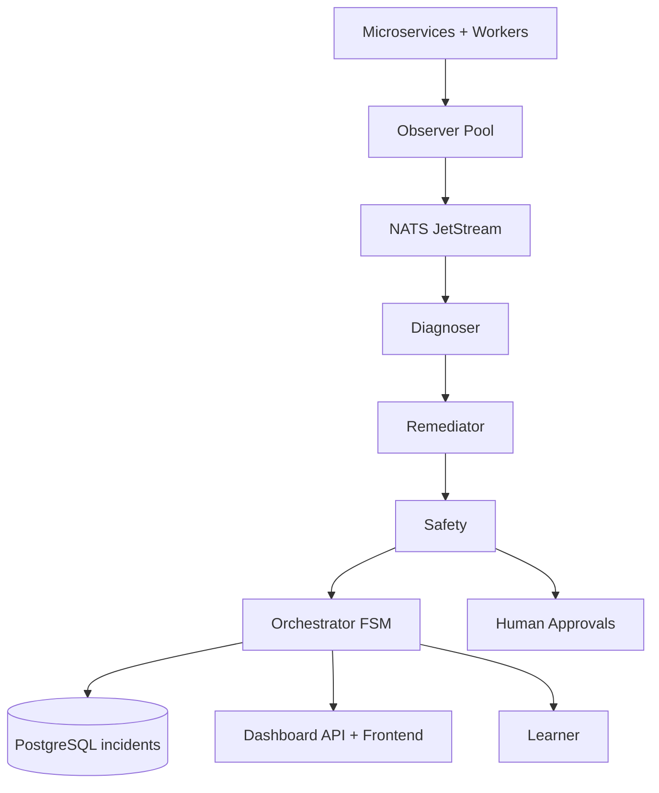
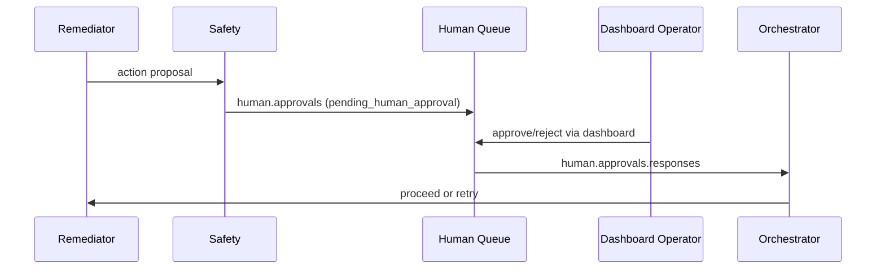

**GitHub Repository:** [View Source Code](https://github.com/anubhav100rao/sre-agent)

Most incident response tooling is still either:
1. Monitoring-only (great at detection, weak at response)
2. Automation-only (great at scripted actions, risky without context)
3. Human-heavy (safe, but slow during pager fatigue)

I wanted a middle path: an event-driven control plane that can detect, diagnose, and remediate incidents automatically, but with explicit safety boundaries and human approval gates for risky actions.

That became **SRE Agent Swarm**.

This is not a toy chatbot attached to logs. It is a system project with:
- A 10+ service failure playground (Python, Go, Node.js, Django)
- A 6-agent incident-response swarm
- Formal incident lifecycle FSM with retries, timeouts, and escalation
- Runbook-driven remediation pipeline with policy enforcement
- Dashboard + WebSocket human-in-the-loop control
- Chaos scenarios with MTTD/MTTR scoring

The rest of this post is a full architecture and implementation walkthrough.

## 1. System Goals and Constraints

### Functional goals

- Detect abnormal behavior quickly (metrics, logs, health, synthetic probes)
- Produce machine-readable root-cause hypotheses
- Map diagnosis to safe and verifiable remediation actions
- Keep a full timeline + postmortem trail for operators
- Learn from previous incidents and improve suggestions over time

### Non-goals

- Replacing all SRE judgement in high-risk production scenarios
- Fully autonomous execution of high-blast-radius actions
- Perfect diagnosis certainty in every ambiguous failure mode

### Constraints that shaped the design

- Incidents are multi-signal and noisy; false positives are costly
- Single-agent architectures become bottlenecks and are hard to reason about
- Purely synchronous pipelines couple components too tightly
- "Auto-fix" systems without policy gates are dangerous

This drove me toward a **multi-agent, event-driven architecture**.

## 2. High-Level Architecture

At a high level there are three planes:
- **Target plane**: application microservices + workers + datastores
- **Control plane**: observer/diagnoser/remediator/safety/orchestrator/learner
- **Operator plane**: dashboard API + WebSocket UI + approval workflow



### Service environment monitored by the swarm

- Gateway: `api-gateway` (`:8000`)
- Core services: `user-svc` (`:8001`), `order-svc` (`:8002`), `auth-svc` (`:8004`), `payment-svc` (`:8005`)
- Extended services: `product-svc` (`:8003`), `search-svc` (`:8006`)
- Workers: `notification-worker` (`:8007`), `inventory-worker` (`:8008`), `analytics-worker` (`:8009`)

Observability stack:
- Prometheus (`:9090`)
- Grafana (`:3000`)
- Loki (`:3100`)
- Tempo (`:3200`)
- AlertManager (`:9093`)

Infrastructure:
- PostgreSQL (incident + service data)
- Redis (cache/session + counters)
- Elasticsearch (search workload)
- NATS JetStream (control-plane messaging backbone)

## 3. Why Event-Driven Messaging (NATS JetStream)

I did not want synchronous RPC chains like:

`Observer -> Diagnoser -> Remediator -> Safety -> Orchestrator`

That pattern is fragile under partial failures and creates tight coupling between agent runtimes.

Instead, each agent publishes and consumes typed messages on subjects. The envelope uses correlation IDs to keep incident context stitched end-to-end.

### Core message envelope (conceptual)

```json
{
  "message_id": "uuid",
  "correlation_id": "incident_id",
  "trace_id": "distributed_trace_key",
  "source_agent": "agents.observer",
  "target_agent": "agents.diagnoser",
  "message_type": "anomaly_detected",
  "priority": 1,
  "ttl_seconds": 120,
  "timestamp": "2026-03-08T10:00:00Z",
  "payload": {},
  "context": {}
}
```

### Important subjects

- `agents.observer.anomalies`
- `agents.diagnoser.requests`
- `agents.diagnoser.results`
- `agents.safety.reviews`
- `agents.safety.decisions`
- `agents.remediator.executions`
- `incidents.lifecycle`
- `human.approvals`
- `human.approvals.responses`

### Streams

- `AGENTS`: agent traffic + heartbeat
- `INCIDENTS`: lifecycle transitions
- `HUMAN`: approval requests/responses
- `BUSINESS`: domain events (`orders.created`, `payments.failed`, etc.)

The key operational benefit: each agent can fail, restart, or scale independently without collapsing the full incident pipeline.

## 4. Agent Roles and Contracts

The swarm has six specialized roles.

### 4.1 Observer

Observer is actually a pool of detectors:
- metrics observer
- log observer
- health observer
- synthetic prober

Main techniques:
- Dynamic z-score anomaly detection over sliding windows
- Static threshold checks for known hard limits
- Deduplication to suppress alert storms
- Trend prediction for early warning (`trend_breach_predicted`)

Representative detector behavior:

```python
# dynamic mode: compare new value to prior baseline
mean = statistics.mean(baseline)
stdev = statistics.stdev(baseline)
z_score = (value - mean) / stdev
if abs(z_score) >= threshold:
    emit_anomaly()
```

This avoids hardcoding every signal to a static threshold and adapts to changing baselines.

### 4.2 Diagnoser

Diagnoser transforms raw anomalies into structured RCA hypotheses.

Pipeline:
1. Correlate related anomalies into an incident context
2. Gather supporting context from metrics/logs/dependencies
3. Generate root-cause hypotheses
4. Run debate/scoring if confidence is weak
5. Publish diagnosis + confidence

LLM strategy is layered:
- Primary: Gemini backend
- Fallback: OpenAI backend
- Last fallback: deterministic heuristics

That fallback chain is practical: diagnosis never hard-fails because one external model backend is down.

### 4.3 Remediator

Remediator maps diagnosis to runbooks and executes actions.

Core components:
- `runbook_engine.py`
- `action_executor.py`
- `verification_engine.py`
- `rollback_manager.py`

Runbooks are YAML and matched by root-cause category + minimum confidence.

```yaml
id: runbook_memory_leak
matches:
  root_cause_category: "memory_leak"
  confidence_minimum: 50
actions:
  - type: "container_restart"
    params:
      target: "{{diagnosis.root_cause.service}}"
    risk: "low"
    approval_required: false
```

Parameter templating lets one runbook apply to many services while still remaining explicit.

### 4.4 Safety

Safety is the most important guardrail in the system.

It decides whether a proposed remediation is:
- `approved`
- `rejected`
- `pending_human_approval`

Current safety stack:
- Policy engine (hard allow/deny logic)
- Blast radius calculation
- Rate limiting / anti-loop controls
- Approval gateway for operator handoff

Representative policy checks:
- High-risk actions require human approval
- Explicit `approval_required: true` forces manual gate
- Certain actions against critical targets are blocked
- Scale operations are capped by replica limit

This turns "autonomous remediation" into **bounded autonomy**.

### 4.5 Orchestrator

Orchestrator is the control-plane brain:
- owns lifecycle state transitions
- routes work between agents
- handles retries/timeouts/escalation
- records incident timeline and postmortem payloads

It subscribes to events from observer, diagnoser, safety, remediator, heartbeat, and human approvals.

### 4.6 Learner

Learner captures incident outcomes and creates long-term memory:
- vectorizes incidents into ChromaDB
- retrieves similar incident patterns
- tracks runbook success and MTTR outcomes

This closes the loop from incident response to incident intelligence.

## 5. Formal Incident Lifecycle (FSM)

I used an explicit finite state machine instead of ad-hoc status strings.

States:

- `detecting`
- `diagnosing`
- `proposing_remediation`
- `safety_review`
- `executing`
- `verifying`
- `resolved`
- `closed`

Allowed transitions are strict (for example, no direct jump from `diagnosing` to `executing`).

```python
TRANSITIONS = {
    "detecting": {"diagnosing"},
    "diagnosing": {"proposing_remediation"},
    "proposing_remediation": {"safety_review"},
    "safety_review": {"executing", "proposing_remediation"},
    "executing": {"verifying", "proposing_remediation"},
    "verifying": {"resolved", "executing"},
    "resolved": {"closed"},
}
```

Timeouts are state-specific (for example `diagnosing: 180s`, `safety_review: 300s`).
Retries are bounded (`MAX_RETRIES_PER_STATE = 2`).

This gives deterministic behavior under failure and simplifies testing.

## 6. End-to-End Control Flow

A typical incident journey:

1. Observer emits anomaly on `agents.observer.anomalies`
2. Orchestrator creates incident record and transitions to `diagnosing`
3. Diagnoser publishes RCA and confidence
4. Orchestrator transitions to `proposing_remediation`
5. Remediator proposes runbook action
6. Safety approves/rejects/escalates
7. If approved, remediator executes + verifies
8. Orchestrator resolves incident or loops with retries
9. Timeline and postmortem are persisted

### Human approval path



This keeps operators in control for high-impact actions without blocking low-risk auto-remediations.

## 7. Data Model and Auditability

Incident state is persisted in PostgreSQL with key fields like:
- status/state
- severity
- diagnosis + confidence
- root cause service/category
- remediation actions
- timeline events
- postmortem payload

Why this matters:
- exact replayability of incident progression
- clear audit trail for automation decisions
- easier post-incident reviews and runbook improvements

The timeline builder appends structured events at major transitions (`anomaly_detected`, `diagnosis_complete`, `action_executed`, `verification_passed`, `resolved`).

## 8. Dashboard and Operator Experience

I built a dedicated dashboard plane:
- FastAPI backend (`dashboard/api`)
- React frontend (`dashboard/frontend`)
- WebSocket manager for live updates

UI surfaces:
- Active incidents and state
- Agent health and heartbeats
- Approval queue for pending actions
- Timeline view for each incident

The dashboard is not just observability UI; it is part of the control path for human decisions.

## 9. Chaos Engineering and Scoring

To avoid "works in demo" syndrome, I added a chaos runner that injects failures and measures the swarm response.

Scenarios currently include:
- `memory_leak`
- `cpu_spike`
- `network_partition`
- `db_overload`

Runner behavior:
1. Inject scenario
2. Poll incident DB
3. Compute MTTD and MTTR
4. Cleanup
5. Emit markdown report

Scoring rubric (letter grade):
- A: fast detection + fast remediation
- B: acceptable response
- C: detected but slow
- F: undetected or timeout

This makes reliability progress measurable, not anecdotal.

## 10. Build and Operations Surface

The Makefile became the operational contract of the project:

```bash
make infra-up      # postgres/redis/nats
make init-nats     # bootstrap streams
make obs-up        # prometheus/grafana/loki/tempo/alertmanager
make up            # microservices playground
make agents-up     # agent swarm
make dashboard-up  # dashboard api + frontend
make test          # unit and service tests
make health        # endpoint checks
```

This reduced setup friction significantly for local reproducibility.

## 11. Testing Strategy

I split tests by concern:
- Unit tests for core modules (detector, FSM, policy, routing)
- Agent integration tests around orchestrator flow
- Service-level tests for microservices
- Chaos runs for system behavior under fault

Notable high-leverage test targets:
- FSM invalid transition prevention
- Retry/timeout escalation behavior
- Safety policy deny paths
- Runbook matching by category/confidence

The major gain from this structure is confidence when refactoring agent interactions.

## 12. Key Design Tradeoffs

### Multi-agent vs single intelligent agent

- Multi-agent increases coordination overhead
- But gives clean specialization and lower cognitive coupling
- Failures are more isolatable and testable

### YAML runbooks vs fully generated actions

- YAML is less "smart" than free-form generation
- But far safer and auditable
- Easier for SRE teams to review and diff

### Strict FSM vs flexible workflow

- FSM can feel rigid initially
- But massively helps with correctness, retries, and incident replay

### Human gate for high-risk actions

- Slower than full automation
- Necessary to avoid high-blast-radius mistakes

## 13. What I Learned

Three practical lessons stood out:

1. **Safety architecture is as important as diagnosis quality.**
A good RCA engine without policy controls is still unsafe in practice.

2. **Correlation IDs are non-negotiable in event-driven systems.**
Without them, debugging and timeline assembly quickly become unmanageable.

3. **Incident systems need lifecycle rigor, not just model intelligence.**
Formal state transitions did more for reliability than adding model complexity.

## 14. What I Would Improve Next

Near-term roadmap:
- richer blast-radius modeling using service dependency graphs
- stronger runbook verification with canary-style post-checks
- tighter learner feedback loop into diagnosis confidence weighting
- deeper SLO/SLA aware remediation prioritization
- better replay tooling for incident simulation from recorded timelines

## 15. Closing

SRE Agent Swarm is my attempt to treat incident response as a systems problem, not just a prompt-engineering problem.

The core idea is simple: combine distributed systems discipline (state machines, message contracts, idempotent flows, retries) with AI-assisted diagnosis, then constrain execution through hard safety boundaries.

That combination made the platform both useful and operable.

If you are building autonomous infrastructure tooling, my strongest recommendation is:

- start with message contracts,
- define your lifecycle state machine early,
- and design safety before you design autonomy.

Everything else compounds from there.
