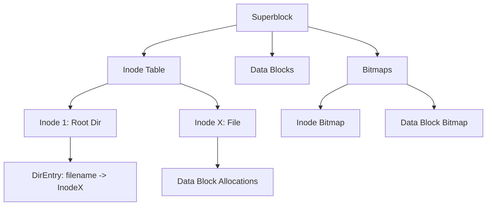

**GitHub Repository:** [View Source Code](https://github.com/anubhav100rao/linux_file_system)

File systems are the unsung heroes of operating systems. We organize files into folders, save data, and retrieve it seamlessly, rarely thinking about how the bits are laid out on a physical disk. To truly understand how systems like `ext2` and `ext3` organize and manage data, I built a **Linux File System Simulator** from scratch in Java.

This project simulates the core structures and mechanisms of a hierarchical file system, focusing heavily on metadata storage, directory management, and free space tracking.

## 🏗️ Architecture Overview

The simulator models a classic Unix/Linux file system layout, abstracting the "disk" into managed components. It deliberately avoids relying on the host operating system's file I/O for its internal structure, instead building the hierarchy purely in memory based on these data structures:

## 🧩 Core Components

Implementing a file system requires abstracting data into discrete structures. Here are the core classes that make up the simulator:

### 1. The Superblock (`Superblock.java`)
The Superblock is the master record of the file system. It contains global configuration and metadata necessary to mount and manage the disk:
- Total number of blocks in the system.
- Total number of inodes.
- Block size.
- Pointers to the start of the inode table and data block regions.

### 2. Inodes (`Inode.java`)
In Unix-like systems, a file's name and its metadata are stored separately. The metadata is housed in an **Inode** (index node). Each inode represents a unique file or directory and stores:
- File size.
- Permissions and ownership.
- Timestamps (creation, modification, access).
- **Block pointers**: An array of indices acting as a map to the actual data blocks where the file's content is stored.

### 3. Bitmaps (`Bitmap.java`)
How does the OS quickly find a free block to write to? Scanning the entire disk is too slow. Instead, the simulator uses a **Bitmap** structure.
We maintain two bitmaps:
- **Inode Bitmap**: Tracks which inode numbers are currently allocated versus free.
- **Data Block Bitmap**: Tracks which physical data blocks are in use.

Allocating a new block simply involves finding the first `0` bit in the bitmap, flipping it to `1`, and returning the corresponding index. This achieves $O(1)$ allocation time.

### 4. Directories (`Directory.java` & `DirectoryEntry.java`)
In Linux, a directory is simply a special type of file. Instead of containing text or binary data, its data blocks contain a list of `DirectoryEntry` objects.
Each `DirectoryEntry` maps a **human-readable string (the filename)** to an **inode number**. 

When you look up `/home/user/hello.txt`, the file system:
1. Reads the root directory's inode.
2. Scans its data blocks for the entry "home" to get its inode.
3. Repeats the process recursively until it resolves "hello.txt" to its specific inode for data retrieval.

## ⚙️ How It Works in Practice

The `FileSystem.java` orchestrates these components to simulate actual disk operations. Here is the operational flow when creating a new file:

1. **Initialization**: The file system initializes the `Superblock`, pre-allocating the `Inode Table` and zeroing out the `Bitmaps`.
2. **Allocation**: When a new file is created, the system queries the Inode Bitmap for a free inode and initializes it.
3. **Directory Linkage**: The parent `Directory` is updated with a new `DirectoryEntry` linking the chosen filename to the newly allocated inode number.
4. **Data Writing**: As data is written to the file, the system queries the Data Block Bitmap for free blocks, updates the inode's block pointers, and writes the simulated payload into the data blocks.
5. **Deletion**: Deleting a file reverses the process — clearing the bits in the bitmaps and removing the `DirectoryEntry`, instantly freeing the space without needing to overwrite the actual data blocks.

## 🎓 Learning Outcomes

Building this simulator demystified the magic of the command line. It makes it obvious why operations like moving a file (`mv`) across the same partition are instantaneous (it just updates a `DirectoryEntry` pointer) while copying (`cp`) takes time (it allocates new inodes and data blocks). It also perfectly illustrates how a disk can run out of inodes even if it has gigabytes of free space left!
